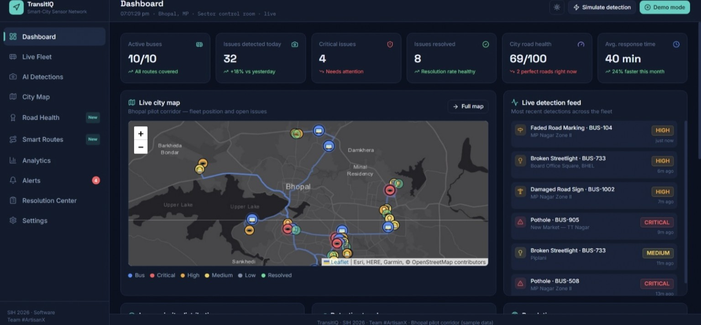
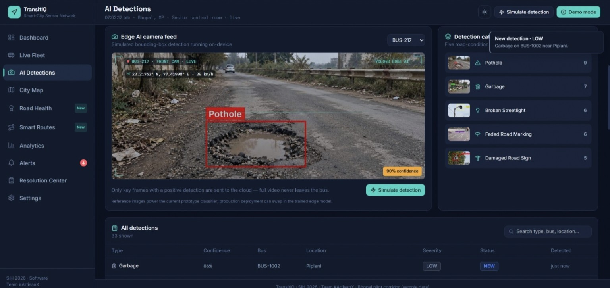
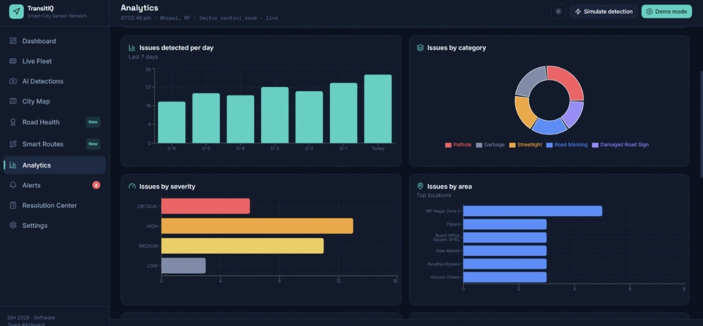

# 🚍 TransitIQ — Smart Road & Public Transport Monitoring System

**SIH 2026 • Team #ArtisanX • Bhopal Pilot Corridor**

TransitIQ is a smart-city monitoring dashboard concept designed to combine road-condition monitoring with public-transport/fleet visibility. The system is designed around data collected from buses and road-monitoring sources, detection of road issues, location-aware prioritization, alerts, and a central operations dashboard.

> **Prototype status:** This repository contains the current browser-based demonstration prototype. Several live-system components such as a production backend, trained edge-AI model, real bus GPS feeds, and a production database are proposed for the full implementation and are not claimed as completed in this prototype.

---

## 📌 Project Overview

Urban roads can develop potholes, damaged signs, broken streetlights, garbage accumulation and faded road markings. At the same time, transport authorities need a single view of fleet movement, road conditions, detected issues and maintenance response.

TransitIQ presents a unified control-room style interface for:

- monitoring active buses and routes
- visualizing road issues on a city map
- classifying road-condition problems
- assigning severity and priority
- tracking issue resolution
- viewing alerts
- analysing issue trends
- supporting a future camera/GPS-based road-monitoring workflow

The current prototype uses **sample/simulated data** to demonstrate the complete user experience.

---

## 🎯 Problem Statement

Traditional road-condition reporting can be fragmented across manual inspections, citizen complaints and separate transport systems. This can make it difficult to continuously identify problems, understand their location and severity, and track whether maintenance actions have been completed.

TransitIQ proposes a unified monitoring layer that can use public-transport vehicles as moving sensing platforms and present the resulting information in one operational dashboard.

---

## 💡 Proposed Solution

TransitIQ follows a continuous monitoring and response workflow:

```text
Bus / Road Monitoring Source
            ↓
      Image / GPS Data
            ↓
     Road-Issue Detection
            ↓
 Classification + Severity
            ↓
 Location + Route Context
            ↓
 Priority / Alert Generation
            ↓
 Transport Control Dashboard
            ↓
 Maintenance Assignment
            ↓
 Resolution Tracking
            ↓
 Analytics & Historical Trends
```

---

# ✨ Key Features

### 1. 📊 Operations Dashboard

The main dashboard provides a control-room overview including:

- Active buses
- Issues detected
- Critical issues
- Issues resolved
- City road-health score
- Average response time
- Live city map
- Live detection feed
- Current issue alerts



---

### 2. 🚌 Live Fleet Monitoring

The fleet section is designed to provide visibility into active buses and route coverage.

The prototype demonstrates the concept of:

- bus status
- route coverage
- vehicle location
- operational monitoring
- fleet-level road observations

---

### 3. 🤖 AI Detection Interface

The AI Detection screen demonstrates a simulated edge-camera workflow.

The prototype displays:

- camera feed
- detected road issue
- bounding-box style visualization
- confidence value
- bus identifier
- location information
- detection category counts
- detection history

Current issue categories include:

- Pothole
- Garbage
- Broken Streetlight
- Faded Road Marking
- Damaged Road Sign



> **Important:** The current screen is a demonstration of the detection workflow. It does not claim that a production YOLO model is running inside this browser prototype.

---

### 4. 🗺️ City Map

TransitIQ provides a map-based view of:

- bus positions
- detected road issues
- issue severity
- route information
- geographic distribution of problems

The prototype uses Leaflet/OpenStreetMap-based mapping for the dashboard visualization.

---

### 5. 🛣️ Road Health Monitoring

The Road Health module is designed to provide a road-condition view based on detected issues and their severity.

The concept supports:

- road-condition scoring
- issue concentration
- priority areas
- deterioration monitoring
- maintenance planning

---

### 6. 🚦 Smart Route / Priority View

The prototype includes a Smart Routes area intended to connect road-condition information with transport routes.

The goal is to help authorities understand:

- which routes encounter more road issues
- where critical issues affect active routes
- where maintenance response may have greater operational impact

---

### 7. 🔔 Alerts

The alert system surfaces issues that require attention.

Alerts can be organized around:

- severity
- location
- affected bus/route
- issue type
- response status

---

### 8. 🛠️ Resolution Center

The Resolution Center represents the maintenance-response stage of the workflow.

Conceptually:

```text
Detection
   ↓
Priority
   ↓
Assignment
   ↓
Maintenance Action
   ↓
Resolution
   ↓
Record / Analytics
```

---

### 9. 📈 Analytics

The Analytics module provides visual summaries of the monitoring data.

The current prototype demonstrates:

- issues detected per day
- issues by category
- issues by severity
- issues by area



These views can support future maintenance planning and trend analysis.

---

### 10. 🌧️ Demo / Simulation Mode

The prototype includes simulation controls so that the monitoring workflow can be demonstrated without requiring live buses or live camera infrastructure.

This makes it possible to demonstrate:

- new detections
- changing dashboard values
- issue alerts
- fleet movement
- road-condition scenarios

---

# 🧩 Core Modules

| Module | Purpose |
|---|---|
| Dashboard | Overall control-room overview |
| Live Fleet | Fleet and route monitoring |
| AI Detections | Road-issue detection workflow |
| City Map | Geographic visualization |
| Road Health | Road-condition assessment |
| Smart Routes | Route-aware monitoring |
| Analytics | Trends and data summaries |
| Alerts | Attention and priority notifications |
| Resolution Center | Maintenance-response tracking |
| Settings | Prototype configuration |

---

# 🏗️ System Architecture

### Proposed full-system architecture

```text
┌─────────────────────────────────────────────────────┐
│              TRANSITIQ ECOSYSTEM                    │
├─────────────────────────────────────────────────────┤
│                                                     │
│  Buses / Cameras        GPS / Fleet Data            │
│         │                       │                   │
│         └───────────┬───────────┘                   │
│                     ↓                               │
│             Edge AI / Detection                    │
│                     ↓                               │
│        Issue Classification & Severity              │
│                     ↓                               │
│            Location / Route Context                  │
│                     ↓                               │
│               Backend Services                      │
│                     ↓                               │
│            Database / Geospatial Data                │
│                     ↓                               │
│             TransitIQ Control Room                  │
│                     ↓                               │
│       Alerts → Assignment → Resolution              │
│                     ↓                               │
│              Analytics & Reports                    │
│                                                     │
└─────────────────────────────────────────────────────┘
```

The architecture above describes the **proposed scalable system**. The current repository primarily demonstrates the dashboard/prototype layer.

---

# 🔄 Detection & Response Workflow

```text
Camera / Image
      ↓
Detection
      ↓
Issue Classification
      ↓
Confidence / Severity
      ↓
GPS / Location
      ↓
Route & Area Context
      ↓
Priority Assignment
      ↓
Alert
      ↓
Maintenance Response
      ↓
Resolution
      ↓
Analytics
```

---

# 💻 Technology Stack

## Current Prototype

- React 18
- ReactDOM 18
- Recharts
- Lucide React
- Leaflet
- HTML/CSS/JavaScript
- Browser-based CDN dependencies

## Proposed Production Architecture

The complete production system can be extended with:

- Edge computer vision / trained object-detection model
- Backend API
- Geospatial database
- Real-time messaging
- Live GPS/vehicle telemetry
- Cloud or edge deployment

These are **future/production components**, not all implemented in the current browser prototype.

---

# 📁 Repository Structure

```text
TransitIQ/
│
├── Frontend/
│   └── index.html
│
├── Docs/
│   └── TransitIQ_Detailed_Report.pdf
│
├── Screenshots/
│   ├── 01_Dashboard.jpg
│   ├── 02_AI_Detections.jpg
│   └── 03_Analytics.jpg
│
└── README.md
```

---

# ⚙️ Running the Prototype

The prototype is a browser-based single-page demonstration.

### Option 1 — Open directly

Open:

```text
Frontend/index.html
```

in a modern browser.

### Option 2 — Local development server

For a more reliable browser environment, serve the `Frontend` directory using any simple local HTTP server.

No production backend or database is required for the current demonstration prototype.

---

# 📄 Documentation

### Detailed Project Report

[Open the Detailed Report](Docs/TransitIQ_Detailed_Report.pdf)

The report covers:

- project overview
- methodology
- prototype modules
- feasibility and impact
- limitations
- future development
- project architecture
- project links

---

# 📸 Prototype Screens

### Dashboard


### AI Detection


### Analytics


---

# 🚀 Future Scope

The prototype can be extended toward a complete city-scale system through:

1. Integration of real bus GPS/telemetry.
2. Deployment of a trained road-condition detection model.
3. Edge inference on bus-mounted hardware.
4. Backend APIs for detection ingestion and management.
5. Geospatial database integration.
6. Real-time event/message streaming.
7. Automated maintenance assignment.
8. Historical road-condition analysis.
9. Model improvement using locally collected road imagery.
10. City-wide deployment and integration with transport-authority systems.

---

# 📊 Current Prototype vs Full System

| Capability | Current Prototype | Future Production System |
|---|---|---|
| Control-room dashboard | ✅ Demonstrated | Extend |
| Fleet visualization | ✅ Simulated | Live GPS |
| Road issue categories | ✅ Demonstrated | Production model |
| AI detection UI | ✅ Demonstrated/simulated | Trained edge model |
| City map | ✅ Demonstrated | Live geospatial data |
| Alerts | ✅ Demonstrated | Real-time backend |
| Resolution workflow | ✅ Demonstrated | Authority integration |
| Analytics | ✅ Demonstrated | Live historical database |
| Backend | — | Planned |
| Production database | — | Planned |
| Live bus telemetry | — | Planned |

---

# 🌍 Intended Impact

TransitIQ is intended to support a more connected approach to road and public-transport monitoring by turning moving public-transport vehicles into potential sensing platforms and bringing road-condition observations into a unified operational interface.

Potential areas of impact include:

- faster identification of road problems
- better visibility of critical locations
- route-aware maintenance planning
- centralized monitoring
- measurable resolution tracking
- historical infrastructure insights

---

# ⚠️ Prototype Limitations

The current demonstration should be interpreted as a **functional UI/prototype concept**, not a deployed city infrastructure system.

In particular:

- displayed bus movement is simulated
- issue detections are simulated/demo data
- Bhopal corridor locations are sample data
- the AI detection screen demonstrates the intended workflow rather than a production-trained model
- no live transport-authority backend is connected
- no live vehicle fleet feed is connected

---

# 👥 Team

**Team #ArtisanX**

**Project:** TransitIQ  
**Event:** Smart India Hackathon 2026  
**Pilot Context:** Bhopal, Madhya Pradesh

---

# 🔗 Project Links

- **GitHub:** https://github.com/akarsha57/TransitIQ
- **Detailed Report:** `Docs/TransitIQ_Detailed_Report.pdf`

---

# 🙏 Acknowledgments

- OpenStreetMap contributors
- Leaflet
- React ecosystem
- Recharts
- Lucide
- Open-source computer-vision ecosystem

---

## 📌 Repository Note

This repository is intended to document the TransitIQ SIH 2026 prototype, its demonstrated workflow, supporting documentation and future production architecture.
